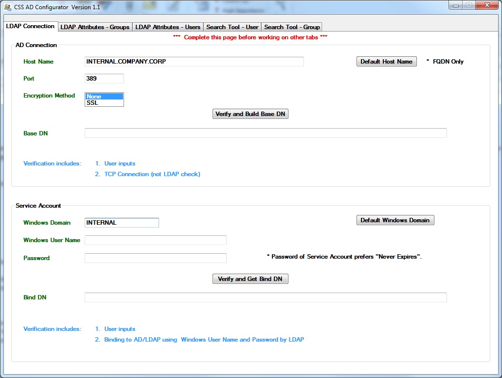

<html xmlns="http://www.w3.org/1999/xhtml">
<head>
    <title>CSS AD Configurator</title>
    <meta http-equiv="Content-Type" content="text/html; charset=UTF-8"/>
    <meta http-equiv="X-UA-Compatible" content="IE=EmulateIE8" />
    <meta content="Scroll Wiki Publisher" name="generator"/>
    <link type="text/css" rel="stylesheet" href="css/blueprint/liquid.css" media="screen, projection"/>
    <link type="text/css" rel="stylesheet" href="css/blueprint/print.css" media="print"/>
    <link type="text/css" rel="stylesheet" href="css/content-style.css" media="screen, projection, print"/>
    <link type="text/css" rel="stylesheet" href="css/screen.css" media="screen, projection"/>
    <link type="text/css" rel="stylesheet" href="css/print.css" media="print"/>
</head>
<body>
                <h1>CSS AD Configurator</h1>
    

        <h2>Overview</h2>
    

        <table>
<thead class=" "></thead><tfoot class=" "></tfoot><tbody class=" ">    <tr>
            <td rowspan="1" colspan="1">
        

Name    

            </td>
                <td rowspan="1" colspan="1">
        

<strong class=" ">CSS AD Configurator</strong>    

            </td>
        </tr>
    <tr>
            <td rowspan="1" colspan="1">
        

For Product    

            </td>
                <td rowspan="1" colspan="1">
        

dynaTrace Data Center RUM    

            </td>
        </tr>
    <tr>
            <td rowspan="1" colspan="1">
        

Description    

            </td>
                <td rowspan="1" colspan="1">
        

This utility allows the user to identify the values that needs to be configured for integrating CSS with Active Directory LDAP.    

            </td>
        </tr>
    <tr>
            <td rowspan="1" colspan="1">
        

Author    

            </td>
                <td rowspan="1" colspan="1">
        

<a href="mailto:Kenneth.Tong@compuware.com">Kenneth Tong</a>    

            </td>
        </tr>
    <tr>
            <td rowspan="1" colspan="1">
        

Version    

            </td>
                <td rowspan="1" colspan="1">
        

1.1    

            </td>
        </tr>
    <tr>
            <td rowspan="1" colspan="1">
        

Support    

            </td>
                <td rowspan="1" colspan="1">
        

<a href="https://community/display/DL/Support+Levels#SupportLevels-Community">Not Supported </a>    

            </td>
        </tr>
    <tr>
            <td rowspan="1" colspan="1">
        

Download    

            </td>
                <td rowspan="1" colspan="1">
        

<a href="attachments_90374326_1_CSS_AD_Configurator.zip">CSS_AD_Configurator.zip</a>    

            </td>
        </tr>
</tbody>        </table>
            

    

    

        <h2>Tool Information</h2>
    

This utility prepopulates some fields with values obtained using the Windows credentials for the current user. It also allows the user to change the values and verify the configuration. Once the configuration is verified, simply copy and paste the values to the proper fields in CSS Active Directory LDAP configuration page    

    

    

        <h2>Installation</h2>
    

There are no installation instructions. This is just an executable. Simply run the executable on the machine that is hosting the CSS.    

    

    

        <h2>Screenshots</h2>
    

            
            

    

            

        

        

        

    

</body>
</html>
